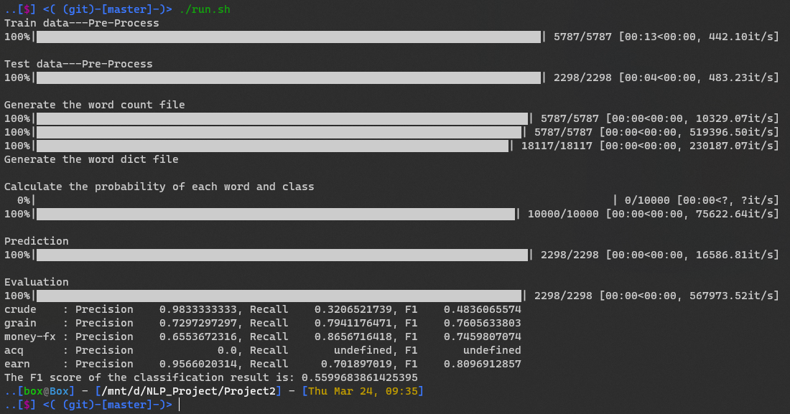

# Project #2
## Introduction
This project is about the implemention of naïve-Bayes text classification model and its evaluatation.

## Description
### Pre-Process
- open file and load as `json` data
    ```python
    with open(inputfile,encoding='utf-8') as f:
        input_dict=json.load(f)
    ```
- stemming
    ```python
    stemmer = nltk.stem.porter.PorterStemmer()
    for i in tqdm.tqdm(input_dict):
        i[2] = re.sub(u"([^\u0041-\u005a\u0061-\u007a ])", "", i[2]).lower().split()
        for k in range(len(i[2])):
            i[2][k] = stemmer.stem(i[2][k])
    ```
- save file as `json` type
    ```python
    with open(outputfile,'w+',encoding='utf-8') as f:
        f.write(json.dumps(input_dict))
    ```
### Word Count
- open file and load as `json` data
    ```python
     with open(inputfile,encoding='utf-8') as f:
        input_dict=json.load(f)
    ```
- count
    ```python
    sta = {}
    for i in tqdm.tqdm(input_dict):
        for word in i[2]:
            if word not in sta:
                sta[word] = {}
            if i[1] not in sta[word]:
                sta[word][i[1]] = 1
            else:
                sta[word][i[1]] += 1
    crude_sum = 0
    grain_sum = 0
    money_sum = 0
    acq_sum = 0
    earn_sum = 0
    for i in tqdm.tqdm(input_dict):
        s=1
        j=i[1]
        if j == 'crude':
            crude_sum += s
        if j == 'grain':
            grain_sum += s
        if j == 'money-fx':
            money_sum += s
        if j == 'acq':
            acq_sum += s
        if j == 'earn':
            earn_sum += s
    res = '{} {} {} {} {}\n'.format(crude_sum, grain_sum, money_sum, acq_sum, earn_sum)
    t_data=[]
    for i in tqdm.tqdm(sta):
        l = sta[i]
        t = 'crude'
        if t in l:
            crude = l[t]
        else:
            crude = 0
        t = 'grain'
        if t in l:
            grain = l[t]
        else:
            grain = 0
        t = 'money-fx'
        if t in l:
            money = l[t]
        else:
            money = 0
        t = 'acq'
        if t in l:
            acq = l[t]
        else:
            acq = 0

        t = 'earn'
        if t in l:
            earn = l[t]
        else:
            earn = 0
        t_data.append([i, crude, grain, money, acq, earn])
    ```
- sort
    ```python
    t_data=sorted(t_data,key=lambda x:x[0])
    ```
- save the data
    ```python
    with open(outputfile, 'w+', encoding='utf-8') as f:
        f.write(res[:-1])
    ```
### Feature Selection
- load stopword dataset from `nltk`
    ```python
    stop=set(stopwords.words('english'))
    ```
- read file and save it in a list
    ```python
    data=[]
    with open(inputfile, encoding='utf-8') as f:
        f.readline()
        line = f.readline()
        while line:
            s=line.split()
            if s[0] not in stop:
                for i in range(1,len(s)):
                    s[i]=int(s[i])
                s.append(s[1]+s[2]+s[3]+s[4]+s[5])
                print(s)
                data.append(s)
            line = f.readline()
    ```
- sort by the frequency of each word and get the most **threshold** frequency words
    ```python
    res=sorted(data,key=lambda x:(x[-1]))[::-1]
    res=res[:threshold]
    ```
- count the frequency of each category
    ```python
    crude_sum = 0
    grain_sum = 0
    money_sum = 0
    acq_sum = 0
    earn_sum = 0
    for i in res:
        crude_sum+=i[1]
        grain_sum += i[2]
        money_sum += i[3]
        acq_sum += i[4]
        earn_sum += i[5]
    ```
- generate the result and save it
    ```python
    st="{} {} {} {} {}\n".format(crude_sum,grain_sum,money_sum,acq_sum,earn_sum)
    for i in res:
        st+="{} {} {} {} {} {}\n".format(i[0],i[1],i[2],i[3],i[4],i[5])
    with open(outputfile, 'w+', encoding='utf-8') as f:
        f.write(st[:-1])
    ```
### Calculate Probability
- calculate the class probability and write them into result
    ```python
    res=""
    with open(word_count, encoding='utf-8') as f:
        line=f.readline().split()
        for i in range(0, len(line)):
            line[i] = int(line[i])
        sum=line[0]+line[1]+line[2]+line[3]+line[4]
        res+="{} {} {} {} {}\n".format(line[0]/sum,line[1]/sum,line[2]/sum,line[3]/sum,line[4]/sum)
    ```
- calculate the word probability and write them into result
    ```python
    data=[]
    with open(word_dict, encoding='utf-8') as f:
        line=f.readline().split()
        for i in range(0, len(line)):
            line[i] = int(line[i])
        p = line
        line=f.readline()
        while line:
            s = line.split()
            for i in range(1, len(s)):
                s[i] = int(s[i])
            data.append(s)
            line=f.readline()
    for i in tqdm.tqdm(data):
        res+="{} {} {} {} {} {}\n".format(
            i[0],
            (i[1] + 1) / (len(data)+p[0]),
            (i[2] + 1) / (len(data)+p[1]),
            (i[3] + 1) / (len(data)+p[2]),
            (i[3] + 1) / (len(data)+p[3]),
            (i[5] + 1) / (len(data)+p[4])
        )
    ```
- save data
    ```python
    with open(outputfile, 'w+', encoding='utf-8') as f:
        f.write(res[:-1])
    ```
### Classify
- get probability data
    ```python
    data={}
    with open(probability, encoding='utf-8') as f:
        line=f.readline().split()
        for i in range(0, len(line)):
            line[i] = float(line[i])
        p = line
        line = f.readline()
        while line:
            s=line.split()
            data[s[0]]=list(map(float,s[1:]))
            line=f.readline()
    ```
- load test data
    ```python
    with open(testset,encoding='utf-8') as f:
        test_data = json.load(f)
    ```
- calculate the probability of each class  and find the max one
    ```python
    for d in tqdm.tqdm(test_data,total=len(test_data)):
        t_data=[]
        for i in range(5):
            p1=p[i]
            for k in d[2]:
                if k in data:
                    p1=p1*data[k][i]
            t_data.append(p1)
        m=t_data[0]
        m_i=0
        for i in range(5):
            if t_data[i]>m:
                m=t_data[i]
                m_i=i
        if m_i==0:
            res+="{} {}\n".format(d[0],'crude')
        if m_i==1:
            res+="{} {}\n".format(d[0],'grain')
        if m_i==2:
            res+="{} {}\n".format(d[0],'money-fx')
        if m_i==3:
            res+="{} {}\n".format(d[0],'acq')
        if m_i==4:
            res+="{} {}\n".format(d[0],'earn')
    ```
- save the result
    ```python
    with open(outputfile, 'w+', encoding='utf-8') as f:
        f.write(res[:-1])
    ```
### F1 score
- `_f1_score(table,index)` get `tp,tn,fn,fp` of one class
    ```python
    tp=0
    tn=0
    fn=0
    fp=0
    for i in range(len(table)):
        for j in range(len(table)):
            if i!=index and j!=index:
                tn+=table[i][j]
    for i in range(len(table)):
        if i!=index:
            fn+=table[index][i]
            fp+=table[i][index]
    tp=table[index][index]
    return tp,tn,fn,fp
    ```
- generate the table from the test file and probability file
    ```python
    t_test=[]
    with open(classification_result, encoding='utf-8') as f:
        line=f.readline()
        while line:
            line=line.split()
            if line[1] == 'crude':
                t_test.append(0)
            if line[1] == 'grain':
                t_test.append(1)
            if line[1] == 'money-fx':
                t_test.append(2)
            if line[1] == 'acq':
                t_test.append(3)
            if line[1] == 'earn':
                t_test.append(4)
            line=f.readline()
    for i in tqdm.tqdm(range(len(t))):
        res[t_test[i]][t[i]]+=1
    ```
- calculate the f1 of each result **(if `tp+fp` or `tp+fn` is zero, the reslut will be set as `undefined` respectively)** , print the result and return the `avg(f1)`
    ```python
    ans=0
    for i in range(5):
        tp, tn, fn, fp=_f1_score(res,i)
        p=tp/(tp+fp) if tp+fp>0 else 'undefined'
        r=tp/(tp+fn) if tp+fn>0 else 'undefined'
        f1=2*(p*r)/(p+r) if p!='undefined' and r!='undefined' else 'undefined'
        output=""
        if i==0:
            output+='crude    '
        if i==1:
            output+='grain    '
        if i==2:
            output+='money-fx '
        if i==3:
            output+='acq      '
        if i==4:
            output+='earn     '
        output+=": Precision {:>15.10}, Recall {:>15.10}, F1 {:>15.10}".format(p,r,f1)
        ans+=f1 if f1!='undefined' else 0
        print(output)
    return ans/5
    ```
## Conclusions
My reslut


